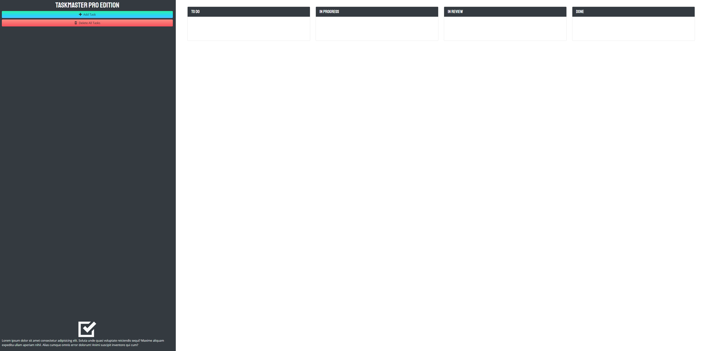
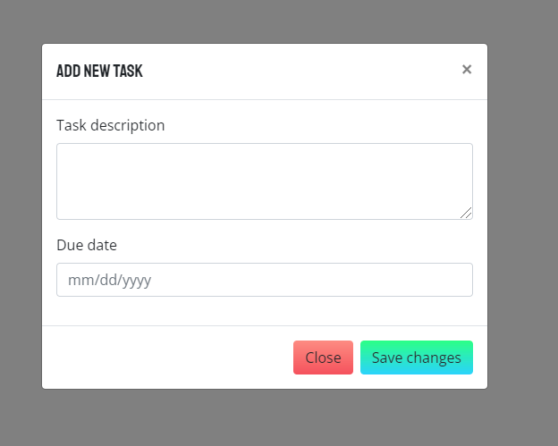
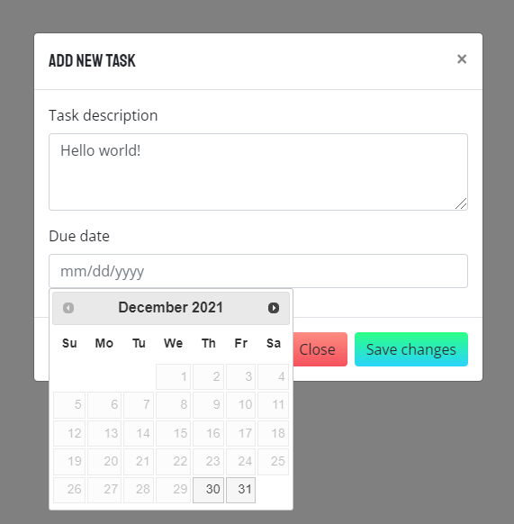
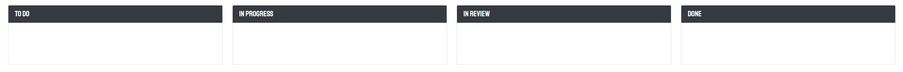
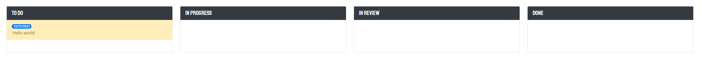
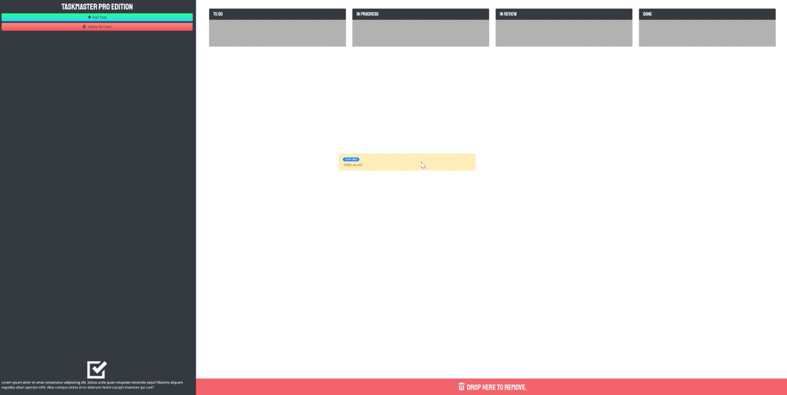

# Taskmaster Pro

## The Repository

This repository contains the HTML, CSS and Javascript code for the Taskmaster Pro Project.

## Taskmaster Pro

Taskmaster Pro combines simplicity and elegance to offer the user an easy way to keep track of important appointments, tasks, meetings, etc. 

## Usage

Users can add a new task by clicking the green "Add Task" button illustrated in the following screenshot:

Doing so will spawn a modal wherein the user can input a new task, along with the due date of the task. Selecting the date input box will present the user with a calendar dropdown for ease of input.

Once the user enters a task and selects a corresponding due date, the "To Do" section shown in the following screenshot will populate with the new task.

Users have the capability to click and drag tasks to other boxes to change the current status of the task. Users can delete all tasks by clicking the "Delete All Tasks" button in the left-hand pane (shown previously), or can drag items to the bottom of the screen to remove tasks individually. 

All tasks are saved to local storage for longevity.

## Deployed Application

the deployed application can be found by following the link below.

https://rrich-kray.github.io/Taskmaster-Pro/

## Feedback

Leave comments/suggestions in the Slack channel!

## License

Copyright &copy; Taskmaster Pro, Inc. All rights reserved.